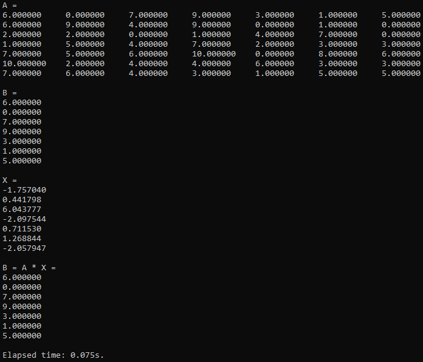
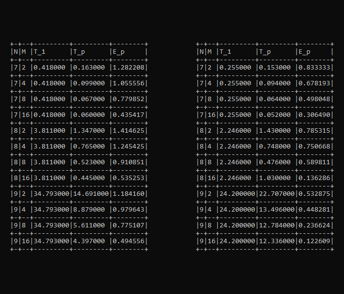

# Технологии параллельного программирования

## Как собрать и запустить

У меня установлены `Windows 10` и `g++ (MinGW.org GCC-6.3.0-1) 6.3.0`. \
Ниже описаны шаги по сборке и запуску.

```batch
git clone git@github.com:tzorake/ppt.git
cd ppt
g++ main.cpp -fopenmp -o main.exe
main.exe
```

## Отчет

### Задание 1
> Реализуйте последовательный алгоритм решения квадратной системы линейных уравнений матричным методом. Для заполнения матрицы и вектора элементами можно воспользоваться генератором случайных чисел. Элементы матрицы и вектора – натуральные числа: a_ij, b_k ∈ (0, ... ,10]; i, j, k = 1, ... ,N. Количество уравнений N на усмотрение студента, в зависимости от сложности вычисления.

Реализован однопоточный метод решения СЛАУ, результат работы кода с консоли: \


### Задание 2
> Реализуйте выполнение операций согласно заданию 1, статическим методом многопоточной обработки. Число потоков задается параметром M.

Реализован статический метод многопоточной обработки решения СЛАУ, результат работы кода с консоли: \


### Задание 3
> Выполните анализ эффективности и ускорения многопоточной обработки при разных параметрах N и M. Результаты представьте в табличной форме и графической форме.

Ранее составленные алгоритмы протестированы указанным в задание методом, результат работы кода с консоли: \


### Задание 5
> Исследуйте эффективность параллелизма при динамической декомпозиции. Сравните с эффективностью статической декомпозиции.

Ранее составленные алгоритмы протестированы для статической и динамической декомпозиции (слева и справа соответственно), результат работы кода с консоли: \

