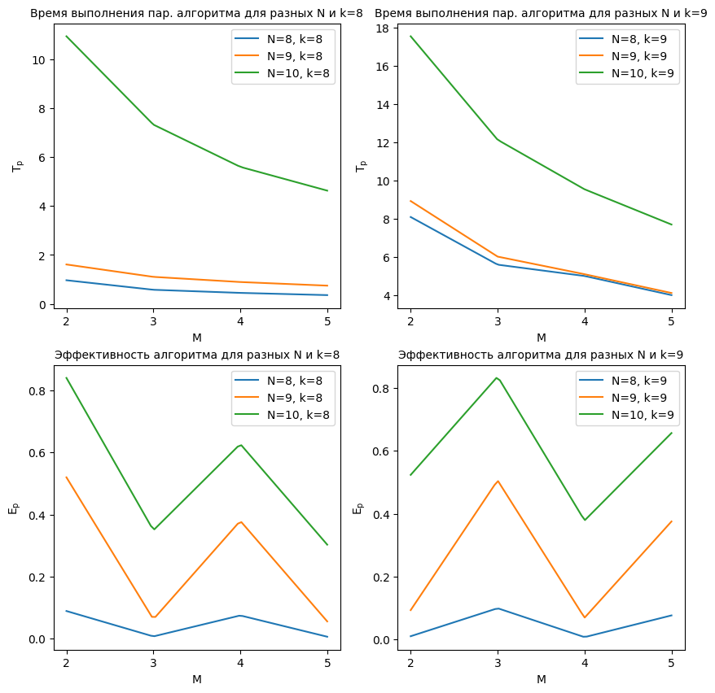

# Технологии параллельного программирования

## Как собрать и запустить

У меня установлены `Ubuntu 22.04.2 LTS` и `g++ (Ubuntu 11.3.0-1ubuntu1~22.04.1) 11.3.0`. \
Ниже описаны шаги по сборке и запуску.

```console
g++ main.cpp -fopenmp -o main
./main
```

## Отчет

### Задание 1
> Реализуйте последовательный алгоритм решения квадратной системы линейных уравнений матричным методом. Для заполнения матрицы и вектора элементами можно воспользоваться генератором случайных чисел. Элементы матрицы и вектора – натуральные числа: `a_ij, b_k ∈ (0, ... ,10]; i, j, k = 1, ... ,N`. Количество уравнений `N` на усмотрение студента, в зависимости от сложности вычисления.

Реализован однопоточный метод решения СЛАУ, результат работы кода с консоли:


### Задание 2
> Реализуйте выполнение операций согласно заданию 1, статическим методом многопоточной обработки. Число потоков задается параметром M.

Реализован статический метод многопоточной обработки решения СЛАУ, результат работы кода с консоли:


### Задание 3
> Выполните анализ эффективности и ускорения многопоточной обработки при разных параметрах N и M. Результаты представьте в табличной форме и графической форме.

Ранее составленные алгоритмы протестированы указанным в задание методом, результат работы кода с консоли:


### Задание 4
> Выполните анализ эффективности при увеличении вычислительной сложности.

Выполнен анализ эффективности при увеличении вычислительной сложности, результат работы кода с консоли:


Результаты из таблицы выше представимы в виде следующей таблицы:



### Задание 5
> Исследуйте эффективность параллелизма при динамической декомпозиции. Сравните с эффективностью статической декомпозиции.

Ранее составленные алгоритмы протестированы для статической и динамической декомпозиции (слева и справа соответственно), результат работы кода с консоли:


Результаты из таблицы выше представимы в виде следующей таблицы:


### Вывод по выполненным заданиям:

В задании 1 был реализован последовательный алгоритм решения квадратной системы линейных уравнений матричным методом. Для этого использовались случайно сгенерированные натуральные числа для заполнения матрицы и вектора. Количество уравнений N было выбрано в зависимости от сложности вычислений.

В задании 2 был реализован многопоточный алгоритм решения квадратной системы линейных уравнений с использованием статической декомпозиции. Число потоков M задавалось параметром и использовалось для разделения вычислительной нагрузки между потоками.

Задание 3 предлагало выполнить анализ эффективности и ускорения многопоточной обработки при разных параметрах `N` и `M`. Результаты анализа должны быть представлены в табличной и графической форме, что позволит определить оптимальные значения `N` и `M` для достижения наилучшей производительности.

В задании 4 требовался анализ эффективности при увеличении вычислительной сложности. Это означает, что необходимо исследовать, как производительность последовательного и многопоточного алгоритмов изменяется при увеличении размера системы линейных уравнений или при более сложных вычислениях.

Задание 5 предлагало исследовать эффективность параллелизма при динамической декомпозиции и сравнить ее с эффективностью статической декомпозиции. Динамическая декомпозиция подразумевает распределение задач между потоками во время выполнения программы в зависимости от доступности ресурсов, в то время как статическая декомпозиция осуществляет равномерное распределение задач заранее.

В целом, выполнение данных заданий позволит проанализировать эффективность и производительность последовательного и многопоточного решения квадратной системы линейных уравнений. Результаты анализа могут помочь определить оптимальные параметры и выбрать наиболее эффективный подход для данной задачи.