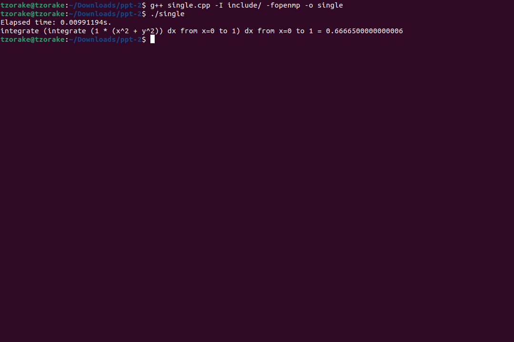
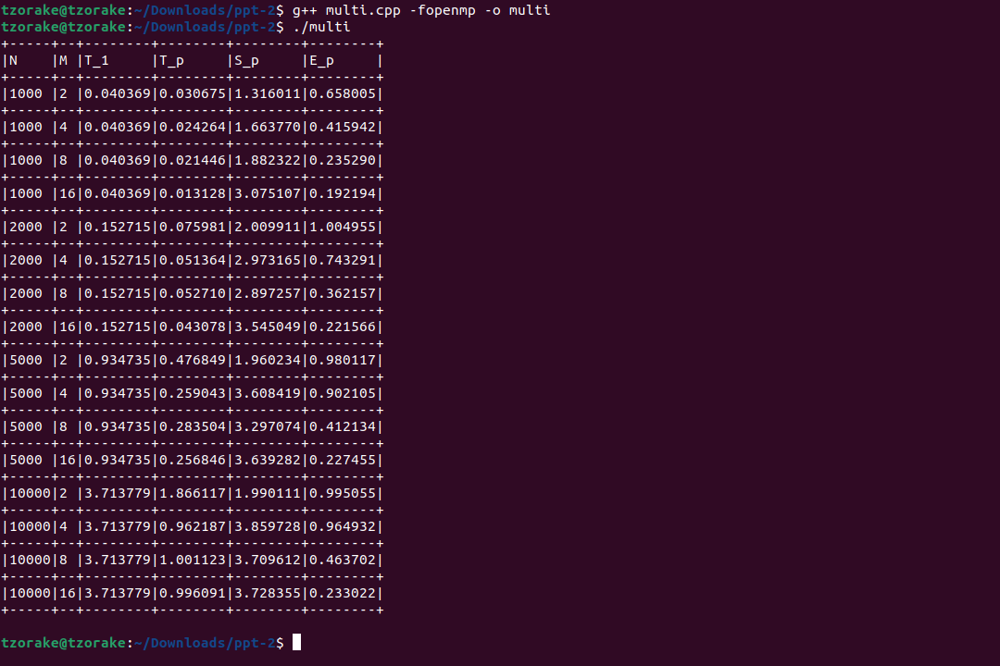

# Технологии параллельного программирования

## Как собрать и запустить

У меня установлены `Ubuntu 22.04.2 LTS` и `g++ (Ubuntu 11.3.0-1ubuntu1~22.04.1) 11.3.0`. \
Ниже описаны шаги по сборке и запуску.

```console
g++ single.cpp -I include/ -fopenmp -o single
./single

g++ multi.cpp -fopenmp -o multi
./multi
```

## Отчет

### Задание 1
> Реализуйте последовательный алгоритм численного решения двойного интеграла от заданной функции, используя квадратурную формулу средних.

Реализуйте последовательный алгоритм численного решения двойного интеграла для функции `f(x, y) = A * (x^B + y^C)`, результат работы кода с консоли: \


### Задание 2
> Реализуйте параллельный алгоритм численного решения двойного интеграла, используя средства `OpenMP`, и проведите анализ эффективности и ускорения параллельной программы при разном количестве потоков параметрах `M` и величинах шага. Результаты представьте в табличной и графической формах. Количество потоков – `4`; количество шагов – `4`. Общее количество вариантов `(M; h)` - `16`.

Реализован параллельный алгоритм численного решения двойного интеграла, результат работы кода с консоли: \

