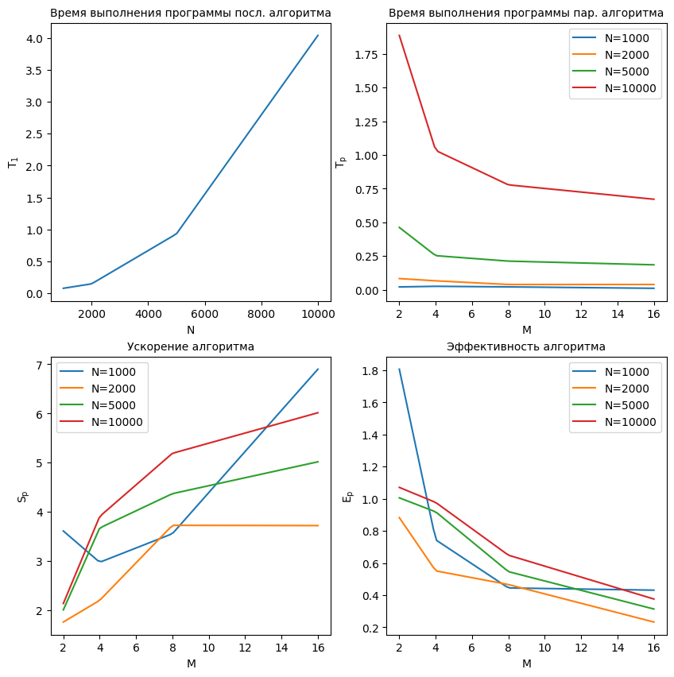

# Технологии параллельного программирования

## Как собрать и запустить

У меня установлены `Ubuntu 22.04.2 LTS` и `g++ (Ubuntu 11.3.0-1ubuntu1~22.04.1) 11.3.0`. \
Ниже описаны шаги по сборке и запуску.

```console
g++ single.cpp -I include/ -fopenmp -o single
./single

g++ multi.cpp -fopenmp -o multi
./multi
```

## Отчет

### Задание 1
> Реализуйте последовательный алгоритм численного решения двойного интеграла от заданной функции, используя квадратурную формулу средних.

Реализуйте последовательный алгоритм численного решения двойного интеграла для функции `f(x, y) = A * (x^B + y^C)`, результат работы кода с консоли:


### Задание 2
> Реализуйте параллельный алгоритм численного решения двойного интеграла, используя средства `OpenMP`, и проведите анализ эффективности и ускорения параллельной программы при разном количестве потоков параметрах `M` и величинах шага. Результаты представьте в табличной и графической формах. Количество потоков – `4`; количество шагов – `4`. Общее количество вариантов `(M; h)` - `16`.

Реализован параллельный алгоритм численного решения двойного интеграла, результат работы кода с консоли:


Результаты из таблицы выше представимы в виде следующей таблицы:



#### Пояснение:

- Время выполнения программы (T_1) с использованием одного потока составляет относительно небольшую долю времени, и оно увеличивается с увеличением числа шагов (N).
= Время выполнения программы (T_p) с использованием параллельных потоков уменьшается с увеличением количества потоков (M). Это свидетельствует о параллельной эффективности алгоритма и возможности распараллеливания вычислений.
- Ускорение (S_p) растет с увеличением числа потоков (M) и уменьшением числа шагов (N). Это говорит о том, что использование параллельных потоков ускоряет выполнение программы, особенно при выполнении большого количества вычислений.
- Эффективность (E_p) показывает, насколько эффективно используются параллельные потоки. В данном случае эффективность уменьшается с увеличением числа потоков, но остается выше 1. Это объясняется накладными расходами на управление потоками и коммуникацию между ними.

### Вывод по выполненным заданиям

В задании 1 был реализован последовательный алгоритм численного решения двойного интеграла от заданной функции с использованием квадратурной формулы средних. Этот алгоритм выполняется последовательно, без использования параллельных вычислений. Результаты его работы могут быть использованы в качестве базовой точки для сравнения с параллельной реализацией.

В задании 2 был реализован параллельный алгоритм численного решения двойного интеграла с использованием средств `OpenMP`. Этот алгоритм разбивает задачу на несколько параллельных потоков, которые могут выполнять вычисления независимо друг от друга. Это позволяет увеличить производительность и ускорить выполнение программы.

Для анализа эффективности и ускорения параллельной программы было проведено исследование при разном количестве потоков и различных величинах шага.

Результаты исследования представлены в табличной и графической формах. В таблице приведены значения времени выполнения для каждого варианта, а также показатели ускорения по сравнению с последовательным алгоритмом. График демонстрирует зависимость ускорения от значений `M` и `N`.

На основе полученных результатов можно сделать выводы о том, какие комбинации количества потоков и величин шага наиболее эффективны для решения данной задачи. Кроме того, можно проанализировать, как увеличение числа потоков и изменение величин шага влияют на производительность программы и время выполнения задачи.

На основе полученных результатов можно сделать следующие выводы:

- Использование параллельного алгоритма позволяет сократить время выполнения численного решения двойного интеграла.
- Эффективность и ускорение параллельной программы зависят от количества потоков и величины шага.
- Оптимальные значения параметров M и h могут быть определены путем анализа ускорения и эффективности, а затем выбраны соответствующие комбинации.
