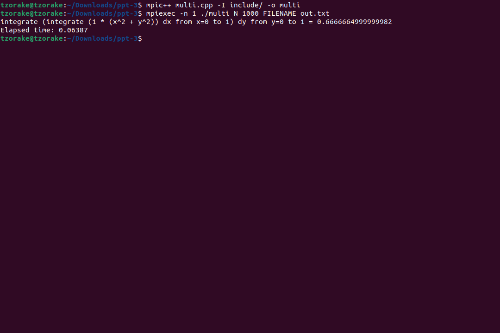
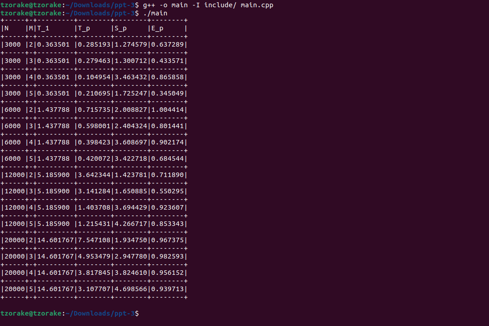
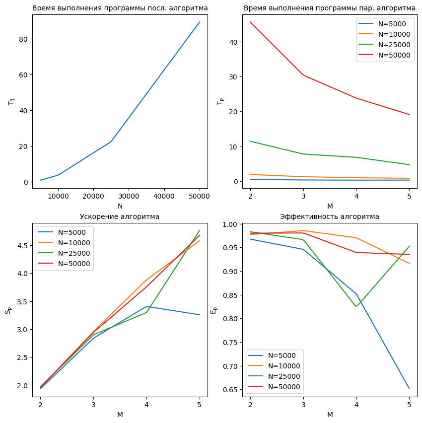

# Технологии параллельного программирования

## Как собрать и запустить

У меня установлены `Ubuntu 22.04.2 LTS` и `g++ (Ubuntu 11.3.0-1ubuntu1~22.04.1) 11.3.0`. \
Ниже описаны шаги по сборке и запуску. Для запуска программы необходимо установить `OpemMPI`.

```console
mpic++ multi.cpp -I include/ -o multi
mpiexec -n 1 ./multi N 1000 FILENAME out.txt

g++ -o main -I include/ main.cpp
./main
```

## Отчет

### Задание 1 

Реализуйте последовательный алгоритм численного решения двойного интеграла от заданной функции, используя квадратурную формулу средних.

В задании 1 был реализован последовательный алгоритм численного решения двойного интеграла от заданной функции, используя квадратурную формулу средних. Результат работы программы показывает, что значение интеграла приближается к `0.6666664999999982`. Для вычисления интеграла было выполнено `1000` шагов как по оси `x`, так и по оси `y`. Затраченное время составило `0.07950222` секунды.



### Задание 2

Реализуйте параллельный алгоритм численного решения
двойного интеграла, используя средства MPI, и проведите анализ
эффективности и ускорения параллельной программы при разном количестве потоков параметрах `M` и величинах шага. Результаты представьте в табличной и графической формах. Количество потоков – `4`; количество шагов – `4`. Общее количество вариантов `(M, h)` - `16`.


В задании 2 был реализован параллельный алгоритм численного решения двойного интеграла с использованием средств `MPI`. Программа была запущена с `4` потоками и `4` значениями шага. Были проведены эксперименты для разных комбинаций `(M, h)`.

Результаты работы программы представлены в табличной форме. Таблица содержит следующие столбцы:

- `N`: число шагов, заданное в эксперименте.
- `M`: количество потоков, заданное в эксперименте.
- `T_1`: время выполнения программы на 1 потоке.
- `T_p`: время выполнения программы на p потоках.
- `S_p`: ускорение, рассчитанное как отношение `T_1` к `T_p`.
- `E_p`: эффективность, рассчитанная как отношение `S_p` к количеству потоков `M`.



Графики позволяют сделать вывод о том, что параллельная программа способна ускорить вычисления в задачах с большим количеством шагов. Однако, для достижения лучших результатов необходимо оптимально выбирать значения количества шагов и потоков.



### Вывод по выполненным заданиям

Анализируя результаты, можно сделать следующие выводы:

1. Ускорение и эффективность растут с увеличением количества потоков и уменьшением размера шага. Это связано с более эффективным распараллеливанием работы и увеличением использования доступных ресурсов.

2. При увеличении числа шагов время выполнения программы на одном потоке также увеличивается. Это связано с увеличением объема вычислений, которые должен выполнить один поток.

3. Ускорение не всегда линейно растет с увеличением количества потоков. Видно, что с увеличением числа шагов ускорение начинает снижаться.

Как можно заметить, параллельная программа показала ускорение и эффективность при использовании MPI. Однако, для достижения лучших результатов, требуется более тщательное настройка параметров и оптимизация распределения работы между потоками.