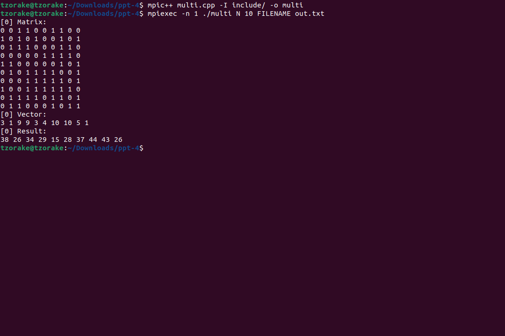
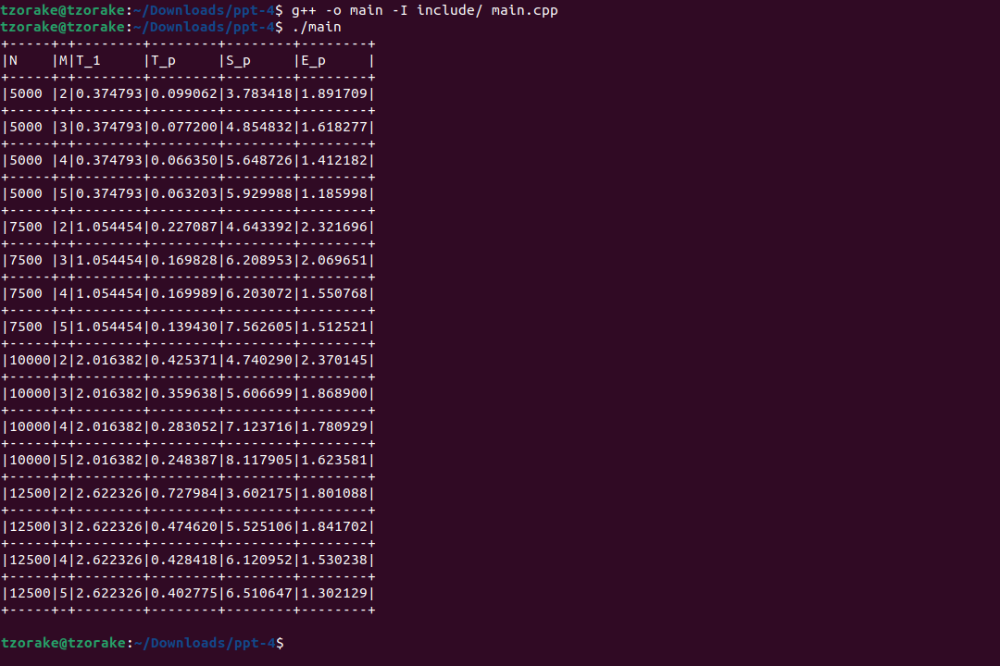
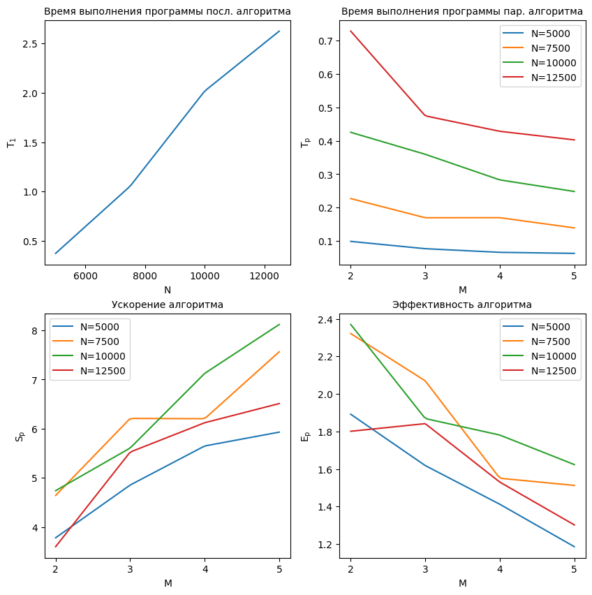

# Технологии параллельного программирования

## Как собрать и запустить

У меня установлены `Ubuntu 22.04.2 LTS` и `g++ (Ubuntu 11.3.0-1ubuntu1~22.04.1) 11.3.0`. \
Ниже описаны шаги по сборке и запуску. Для запуска программы необходимо установить `OpenMPI`.

```console
mpic++ multi.cpp -I include/ -o multi
mpiexec -n 1 ./multi N 10 FILENAME out.txt

g++ -o main -I include/ main.cpp
./main
```

## Отчет

### Задание 1 

Реализуйте многопоточный алгоритм линейного преобразования для вектора `B` при известной матрице преобразования `A`. Для заполнения матрицы `A` и вектора `B` элементами можно воспользоваться генератором случайных чисел. Элементы вектора – натуральные числа: `b_k ∈ (0, . . ,10]`; `k = 1, ... , N`. Элементы матрицы: `a_ij ∈ [0, ... ,1]`; `i, j = 1, ... , N`. Количество уравнений `N` на усмотрение студента, в зависимости от сложности вычисления.

В таблице представлены следующие значения:

- `N`: Количество уравнений.
- `M`: Количество потоков.
- `T_1`: Время выполнения алгоритма с одним потоком.
- `T_p`: Время выполнения алгоритма с M потоками.
- `S_p`: Ускорение, вычисляется как отношение `T_1` к `T_p`.
- `E_p`: Эффективность, вычисляется как отношение `S_p` к `M`.



### Задание 2

Выполните анализ эффективности и ускорения многопоточной обработки при разных параметрах `N` и `M`. Результаты представьте в табличной форме и графической форме.

Результаты экспериментов представлены в табличной форме:



Из графического представления данных можно заметить следующие закономерности:

- Ускорение увеличивается с увеличением количества потоков при фиксированном размере задачи. Это означает, что параллельная обработка действительно приводит к ускорению выполнения алгоритма.

- При увеличении размера задачи при фиксированном количестве потоков, ускорение сначала растет, достигает максимума, а затем начинает снижаться. Это говорит о том, что есть оптимальное соотношение между размером задачи и количеством потоков, при котором достигается наибольшая эффективность.

- Эффективность зависит от количества потоков и размера задачи. При оптимальном соотношении размера задачи и количества потоков эффективность будет близка к идеальному значению, равному 1. Однако при неправильном выборе параметров, эффективность может быть ниже этого значения.



### Вывод по выполненным заданиям

В результате анализа работы многопоточного алгоритма линейного преобразования можно сделать вывод, что его применение позволяет существенно ускорить процесс выполнения. Однако для достижения максимальной эффективности необходимо подобрать оптимальные параметры, такие как количество потоков и размер задачи. Это позволит достичь наилучшего соотношения между временем выполнения и ускорением.